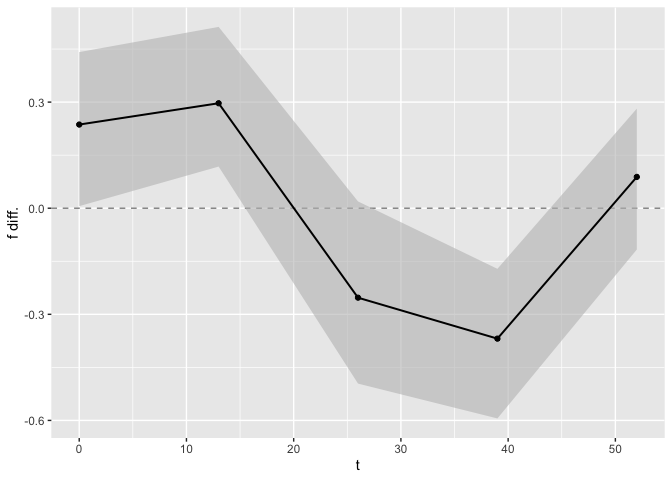

<!-- README.md is generated from README.Rmd. Please edit that file -->

# plsmmLasso

<!-- badges: start -->

[](https://github.com/Sami-Leon/plsmmLasso/actions/workflows/R-CMD-check.yaml)
<!-- badges: end -->

The goal of plsmmLasso is to allow the estimation of a Regularized
Partial Linear Semiparametric Mixed-Effects Model (PLSMM) using a
dictionary approach for modeling the nonparametric component of the
model. Using a set of bases functions the model automatically select the
bases functions using a lasso penalty and perform variable selection
with another lasso penalty on the fixed-effects. The implementation
allow for the incorporation of a random intercept as well.

## Installation

You can install the development version of plsmmLasso from
[GitHub](https://github.com/) with:

``` r
# install.packages("devtools")
devtools::install_github("Sami-Leon/plsmmLasso")
```

## Example I

### Fitting the model

This is a basic example using a simulated dataset to show how to use the
main function of the plsmmLasso package. Here we assume a grouping
variable and different nonlinear functions for each group.

``` r
library(plsmmLasso)

# Simulate a dataset
set.seed(123)
data_sim <- simulate_group_inter(
  N = 50, n_mvnorm = 3, grouped = TRUE,
  timepoints = 3:5, nonpara_inter = TRUE,
  sample_from = seq(0, 52, 13), 
  cos = FALSE, A_vec = c(1, 1.5)
)
sim <- data_sim$sim

# Fit the data
x <- as.matrix(sim[, -1:-3])
y <- sim$y
series <- sim$series
t <- sim$t
bases <- create_bases(t)
lambda <- 0.0046
gamma <- 0.00001
plmm_output <- plmm_lasso(x, y, series, t,
  name_group_var = "group", bases$bases,
  gamma = gamma, lambda = lambda, timexgroup = TRUE,
  criterion = "BIC"
)
```

One the most important output of the object plmm_output are the
estimates of the fixed-effects.

``` r
plmm_output$lasso_output$theta
#>  Intercept      group         x1         x2         x3         x4         x5 
#> 0.19729689 3.15155151 1.91905369 0.74891414 0.02274130 0.01291499 0.01049015
```

Here we see that some covariates have small values, but most are
non-zeros. If we want more regularization for the fixed-effects we can
use a larger value for lambda.

``` r
lambda <- 0.1
plmm_output <- plmm_lasso(x, y, series, t,
  name_group_var = "group", bases$bases,
  gamma = gamma, lambda = lambda, timexgroup = TRUE,
  criterion = "BIC"
)
```

With a larger lasso penalty more coefficients are set to zero. The
coefficients associated to the nonlinear functions are alpha.

``` r
plmm_output$lasso_output$alpha
#>   [1] -5.576108e-02 -4.720350e-01 -8.130512e-03  2.368476e-10 -7.129181e-06
#>   [6]  0.000000e+00  0.000000e+00 -1.979628e-03 -8.520939e-07  7.143250e-12
#>  [11] -1.708684e-10  0.000000e+00  0.000000e+00 -4.155503e-15  0.000000e+00
#>  [16]  0.000000e+00  0.000000e+00  0.000000e+00  0.000000e+00  0.000000e+00
#>  [21]  0.000000e+00  0.000000e+00  0.000000e+00  0.000000e+00  0.000000e+00
#>  [26]  0.000000e+00  0.000000e+00  0.000000e+00  0.000000e+00  0.000000e+00
#>  [31]  0.000000e+00 -6.356410e-17  0.000000e+00  0.000000e+00  0.000000e+00
#>  [36]  0.000000e+00  0.000000e+00  0.000000e+00  0.000000e+00  0.000000e+00
#>  [41]  0.000000e+00  0.000000e+00  0.000000e+00  0.000000e+00  0.000000e+00
#>  [46]  0.000000e+00  0.000000e+00  0.000000e+00  0.000000e+00  0.000000e+00
#>  [51]  0.000000e+00  0.000000e+00 -1.271282e-16  0.000000e+00  0.000000e+00
#>  [56] -7.945512e-18  0.000000e+00  0.000000e+00  0.000000e+00  0.000000e+00
#>  [61]  0.000000e+00 -2.185016e-15  0.000000e+00  0.000000e+00  0.000000e+00
#>  [66]  0.000000e+00  0.000000e+00  0.000000e+00  0.000000e+00  0.000000e+00
#>  [71] -3.202041e-14  0.000000e+00  0.000000e+00  0.000000e+00  0.000000e+00
#>  [76]  0.000000e+00  0.000000e+00  0.000000e+00  0.000000e+00  0.000000e+00
#>  [81]  0.000000e+00  0.000000e+00  0.000000e+00  0.000000e+00  7.436122e-02
#>  [86]  6.218255e-02  4.954405e-02  3.692713e-02  2.435388e-02  1.184531e-02
#>  [91]  0.000000e+00  0.000000e+00  0.000000e+00  0.000000e+00  0.000000e+00
#>  [96]  0.000000e+00  0.000000e+00  0.000000e+00  0.000000e+00  0.000000e+00
#> [101]  0.000000e+00  0.000000e+00  0.000000e+00  0.000000e+00  0.000000e+00
#> [106]  0.000000e+00  0.000000e+00  0.000000e+00  0.000000e+00  0.000000e+00
#> [111]  0.000000e+00  0.000000e+00  0.000000e+00  0.000000e+00  0.000000e+00
#> [116]  0.000000e+00  0.000000e+00  0.000000e+00  0.000000e+00  0.000000e+00
#> [121]  0.000000e+00  0.000000e+00  0.000000e+00  0.000000e+00  0.000000e+00
#> [126]  0.000000e+00  0.000000e+00  0.000000e+00  0.000000e+00  0.000000e+00
#> [131]  0.000000e+00  0.000000e+00  0.000000e+00  0.000000e+00  0.000000e+00
#> [136]  0.000000e+00  0.000000e+00  0.000000e+00  0.000000e+00  0.000000e+00
#> [141]  0.000000e+00  0.000000e+00  0.000000e+00  0.000000e+00  0.000000e+00
#> [146]  0.000000e+00  0.000000e+00  0.000000e+00  0.000000e+00  0.000000e+00
#> [151]  0.000000e+00  0.000000e+00  0.000000e+00  0.000000e+00  0.000000e+00
#> [156]  0.000000e+00  0.000000e+00  0.000000e+00  0.000000e+00  0.000000e+00
#> [161]  0.000000e+00  0.000000e+00  0.000000e+00  0.000000e+00  0.000000e+00
#> [166]  0.000000e+00  0.000000e+00  0.000000e+00  0.000000e+00  0.000000e+00
#> [171]  0.000000e+00  0.000000e+00  0.000000e+00  0.000000e+00  4.657899e-01
#> [176] -2.884404e-01  1.830952e-02  0.000000e+00 -3.858819e-03  0.000000e+00
#> [181]  0.000000e+00 -1.471157e-13  4.909381e-04  0.000000e+00 -1.034676e-04
#> [186]  0.000000e+00  0.000000e+00 -1.271730e-13  1.297435e-05  0.000000e+00
#> [191] -2.734406e-06  0.000000e+00  0.000000e+00 -1.381600e-15  3.428817e-07
#> [196]  0.000000e+00 -7.226432e-08  0.000000e+00  0.000000e+00 -1.052647e-15
#> [201]  9.061608e-09  0.000000e+00 -1.909313e-09  0.000000e+00  0.000000e+00
#> [206] -1.488509e-15  2.394192e-10  0.000000e+00 -5.041202e-11  0.000000e+00
#> [211]  0.000000e+00 -1.776343e-15  6.322149e-12  0.000000e+00 -1.612936e-12
#> [216]  0.000000e+00  0.000000e+00 -1.776343e-15  2.026228e-13  0.000000e+00
#> [221] -3.835831e-13  0.000000e+00  0.000000e+00 -8.388285e-16  4.805695e-14
#> [226]  0.000000e+00  0.000000e+00  0.000000e+00  0.000000e+00  0.000000e+00
#> [231]  0.000000e+00  0.000000e+00 -1.360062e-12  0.000000e+00  0.000000e+00
#> [236]  0.000000e+00  1.692026e-13  0.000000e+00  0.000000e+00  0.000000e+00
#> [241]  0.000000e+00  0.000000e+00  0.000000e+00  0.000000e+00  0.000000e+00
#> [246]  0.000000e+00  0.000000e+00  0.000000e+00  0.000000e+00  0.000000e+00
#> [251] -5.838904e-16  0.000000e+00  0.000000e+00  0.000000e+00  0.000000e+00
#> [256]  0.000000e+00  0.000000e+00  0.000000e+00  0.000000e+00  0.000000e+00
#> [261]  0.000000e+00  0.000000e+00  0.000000e+00  0.000000e+00  0.000000e+00
#> [266]  0.000000e+00  0.000000e+00  0.000000e+00  0.000000e+00  0.000000e+00
#> [271]  0.000000e+00  0.000000e+00  0.000000e+00  0.000000e+00  0.000000e+00
#> [276]  0.000000e+00  0.000000e+00  0.000000e+00  0.000000e+00  0.000000e+00
#> [281]  0.000000e+00  0.000000e+00  0.000000e+00  0.000000e+00  0.000000e+00
#> [286]  0.000000e+00  0.000000e+00  0.000000e+00  0.000000e+00  0.000000e+00
#> [291]  0.000000e+00  0.000000e+00  0.000000e+00  0.000000e+00  0.000000e+00
#> [296]  0.000000e+00  0.000000e+00  0.000000e+00  0.000000e+00  0.000000e+00
#> [301]  0.000000e+00  0.000000e+00  0.000000e+00  0.000000e+00  0.000000e+00
#> [306]  0.000000e+00  0.000000e+00  0.000000e+00  0.000000e+00  0.000000e+00
#> [311]  0.000000e+00  0.000000e+00  0.000000e+00  0.000000e+00  0.000000e+00
#> [316]  0.000000e+00  0.000000e+00  0.000000e+00  0.000000e+00  0.000000e+00
#> [321]  0.000000e+00  0.000000e+00  0.000000e+00  0.000000e+00  0.000000e+00
#> [326]  0.000000e+00  0.000000e+00  0.000000e+00  0.000000e+00  0.000000e+00
#> [331]  0.000000e+00  0.000000e+00  0.000000e+00  0.000000e+00  0.000000e+00
#> [336]  0.000000e+00  0.000000e+00  0.000000e+00  0.000000e+00  0.000000e+00
#> [341]  0.000000e+00  0.000000e+00  0.000000e+00  0.000000e+00 -1.984519e-01
#> [346] -1.936801e-01 -1.879392e-01 -1.822748e-01
```

Similar behavior would be observe for the alphas if we were to increase
the value of gamma.

To find optimal values for gamma and lambda we tune these
hyperparameters using BIC-type criteria using the tune_plmm function and
a grid search.

``` r
lambdas <- gammas <- round(exp(seq(log(1), log(1 * 0.00001),
              length.out = 5
)), digits = 5)

tuned_plmm <- tune_plmm(x, y, series, t,
                       name_group_var = "group", bases$bases,
                       gamma_vec = gammas, lambda_vec = lambdas, timexgroup = TRUE,
                       criterion = "BIC"
)
```

The function tuned_plmm tries every possible combination of the values
from lambdas and gamma and returns the model with the best BIC. This
example is for illustration only and typicaly wider and finer grid
should be used.

### Plotting the results

The function plot_fit allows for the vizualisation of the estimated mean
trajectories as well as the estimate of the nonlinear functions. By
default only the observed time points are being used, to use predicted
time points the argument predicted can be set to TRUE.

``` r
plot_fit(x, y, series, t, name_group_var = "group", tuned_plmm)
```


``` r

plot_fit(x, y, series, t, name_group_var = "group", tuned_plmm, predicted = TRUE)
```


### Post-selection inference

To compute p-values on the fixed-effects the function debias_plmm can be
used.

``` r
debias_plmm(x, y, series, tuned_plmm)
#> Nodewise regressions will be computed as no argument Z was provided.
#> You can store Z to avoid the majority of the computation next time around.
#> Z only depends on the design matrix x.
#>         Estimate   Debiased Std. Error   Lower 95% Upper 95%      p-value
#> group 3.20441442 3.31447827 0.33608394  2.65575376 3.9732028 6.079223e-23
#> x1    1.95569696 2.03694234 0.21339004  1.61869786 2.4551868 1.352832e-21
#> x2    0.72925412 0.68895582 0.26577859  0.16802979 1.2098818 9.535955e-03
#> x3    0.02755599 0.03780433 0.04645279 -0.05324313 0.1288518 4.157466e-01
#> x4    0.01691564 0.02535323 0.04110770 -0.05521786 0.1059243 5.373988e-01
#> x5    0.01569818 0.02732562 0.04056090 -0.05217374 0.1068250 5.005061e-01
```

The function reports the original coefficients, debiased coeffcients,
standard error, confidence intervals and p-values. These p-values are
already ajudsted for the selection process of the lasso, and provide
valid inference.

### Test on the nonlinear functions

Finally we can perform some tests on the nonlinear functions. The first
element of the list is an overall test of equality, if the p-value is
$<0.05$ we reject the null hypothesis of equality, and conclude that
overall the two nonlinear functions are different. To obtain a
comparison at each time point confidence bands are computed, and a
figure displaying these confidence bands is generated. For the time
points associated with confidence bands that include $0$ we can not
reject the null hypothesis that the nonlinear functions are the same for
this time point. The data.frame that is used to generate this figure can
be found in the second element of the output list.

``` r
test_f_results <- test_f(x, y, series, t,
 name_group_var = "group", tuned_plmm,
 n_boot = 10
)
#>   |                                                                              |                                                                      |   0%  |                                                                              |=======                                                               |  10%  |                                                                              |==============                                                        |  20%  |                                                                              |=====================                                                 |  30%  |                                                                              |============================                                          |  40%  |                                                                              |===================================                                   |  50%  |                                                                              |==========================================                            |  60%  |                                                                              |=================================================                     |  70%  |                                                                              |========================================================              |  80%  |                                                                              |===============================================================       |  90%  |                                                                              |======================================================================| 100%
#> Completed fitting Bootstrap samples. Now formatting results, and generating figure.
```



``` r
test_f_results[[1]]
#>           T p-value
#> 1 0.4785269       0
test_f_results[[2]]
#>        t       f diff.    Lower 95%     Upper 95%
#> 1    0.0  0.2365326807  0.005867910  0.4414301000
#> 2    0.1  0.2400843209  0.010512969  0.4443027707
#> 3    0.2  0.2436013182  0.015122468  0.4471455502
#> 4    0.3  0.2470831632  0.019695617  0.4499581695
#> 5    0.4  0.2505293515  0.024231627  0.4527403658
#> 6    0.5  0.2539393837  0.028729712  0.4554918826
#> 7    0.6  0.2573127654  0.033189090  0.4582124695
#> 8    0.7  0.2606490075  0.037608983  0.4609018825
#> 9    0.8  0.2639476262  0.041988616  0.4635598833
#> 10   0.9  0.2672081427  0.046327218  0.4661862403
#> 11   1.0  0.2704300838  0.050624021  0.4687807279
#> 12   1.1  0.2736129817  0.054878262  0.4713431265
#> 13   1.2  0.2767563739  0.059089182  0.4738732229
#> 14   1.3  0.2798598037  0.063256026  0.4763708098
#> 15   1.4  0.2829228200  0.067378042  0.4788356862
#> 16   1.5  0.2859449770  0.071454485  0.4812676571
#> 17   1.6  0.2889258351  0.075484614  0.4836665333
#> 18   1.7  0.2918649602  0.079467690  0.4860321319
#> 19   1.8  0.2947619241  0.083402983  0.4883642755
#> 20   1.9  0.2976163046  0.087289766  0.4906627930
#> 21   2.0  0.3004276854  0.091127317  0.4929275188
#> 22   2.1  0.3031956561  0.094914921  0.4951582929
#> 23   2.2  0.3059198126  0.098651866  0.4973549611
#> 24   2.3  0.3085997568  0.102337450  0.4995173747
#> 25   2.4  0.3112350967  0.105970974  0.5016453903
#> 26   2.5  0.3138254468  0.109551745  0.5037388699
#> 27   2.6  0.3163704276  0.113079078  0.5057976805
#> 28   2.7  0.3188696661  0.116552294  0.5078216944
#> 29   2.8  0.3213227956  0.119970721  0.5098107888
#> 30   2.9  0.3237294560  0.123333695  0.5117648454
#> 31   3.0  0.3260892935  0.126640558  0.5136837509
#> 32   3.1  0.3284019609  0.129890661  0.5155673962
#> 33   3.2  0.3306671177  0.133083361  0.5174156765
#> 34   3.3  0.3328844299  0.136218025  0.5192284915
#> 35   3.4  0.3350535703  0.139294029  0.5210057443
#> 36   3.5  0.3371742183  0.142310756  0.5227473422
#> 37   3.6  0.3392460601  0.145267598  0.5244531958
#> 38   3.7  0.3412687888  0.148163958  0.5261232193
#> 39   3.8  0.3432421043  0.150999247  0.5277573298
#> 40   3.9  0.3451657134  0.153772887  0.5293554474
#> 41   4.0  0.3470393299  0.156484310  0.5309174950
#> 42   4.1  0.3488626744  0.159132959  0.5324433978
#> 43   4.2  0.3506354747  0.161718286  0.5339330836
#> 44   4.3  0.3523574657  0.164239757  0.5353864817
#> 45   4.4  0.3540283893  0.166696847  0.5368035236
#> 46   4.5  0.3556479945  0.169089044  0.5381841422
#> 47   4.6  0.3572160376  0.171415849  0.5395282714
#> 48   4.7  0.3587322820  0.173676775  0.5408358466
#> 49   4.8  0.3601964985  0.175871346  0.5421068036
#> 50   4.9  0.3616084649  0.177999102  0.5433410789
#> 51   5.0  0.3629679667  0.180059595  0.5445386092
#> 52   5.1  0.3642747963  0.182052392  0.5456993313
#> 53   5.2  0.3655287539  0.183977072  0.5468231817
#> 54   5.3  0.3667296469  0.185833231  0.5479100965
#> 55   5.4  0.3678772901  0.187620478  0.5489600110
#> 56   5.5  0.3689715058  0.189338439  0.5499728598
#> 57   5.6  0.3700121240  0.190986753  0.5509485762
#> 58   5.7  0.3709989818  0.192565076  0.5518870920
#> 59   5.8  0.3719319243  0.194073082  0.5527883375
#> 60   5.9  0.3728108038  0.195510457  0.5536522414
#> 61   6.0  0.3736354805  0.196876908  0.5544787301
#> 62   6.1  0.3744058220  0.198172155  0.5552677281
#> 63   6.2  0.3751217037  0.199395938  0.5560191574
#> 64   6.3  0.3757830086  0.200548014  0.5567329376
#> 65   6.4  0.3763896273  0.201628155  0.5574089856
#> 66   6.5  0.3769414583  0.202636153  0.5580472154
#> 67   6.6  0.3774384076  0.203571818  0.5586475385
#> 68   6.7  0.3778803892  0.204434976  0.5592098631
#> 69   6.8  0.3782673245  0.205225474  0.5597340943
#> 70   6.9  0.3785991431  0.205943175  0.5602201344
#> 71   7.0  0.3788757821  0.206587962  0.5606678821
#> 72   7.1  0.3790971864  0.207159736  0.5610772331
#> 73   7.2  0.3792633089  0.207658415  0.5614480800
#> 74   7.3  0.3793741102  0.208083939  0.5617803119
#> 75   7.4  0.3794295587  0.208436265  0.5620738149
#> 76   7.5  0.3794296308  0.208715367  0.5623284719
#> 77   7.6  0.3793743106  0.208921241  0.5625441625
#> 78   7.7  0.3792635902  0.209053899  0.5627207636
#> 79   7.8  0.3790974694  0.209113373  0.5628581490
#> 80   7.9  0.3788759560  0.209099713  0.5629561897
#> 81   8.0  0.3785990656  0.209012989  0.5630147540
#> 82   8.1  0.3782668219  0.208853286  0.5630337078
#> 83   8.2  0.3778792561  0.208620711  0.5630129145
#> 84   8.3  0.3774364077  0.208315387  0.5629522353
#> 85   8.4  0.3769383237  0.207937456  0.5628515297
#> 86   8.5  0.3763850594  0.207487076  0.5627106552
#> 87   8.6  0.3757766775  0.206964424  0.5625294678
#> 88   8.7  0.3751132489  0.206369694  0.5623078222
#> 89   8.8  0.3743948524  0.205703098  0.5620455723
#> 90   8.9  0.3736215745  0.204964864  0.5617425709
#> 91   9.0  0.3727935097  0.204155236  0.5613986707
#> 92   9.1  0.3719107602  0.203274476  0.5610137239
#> 93   9.2  0.3709734361  0.202322861  0.5605875831
#> 94   9.3  0.3699816554  0.201300683  0.5601201011
#> 95   9.4  0.3689355439  0.200208251  0.5596111315
#> 96   9.5  0.3678352352  0.199045888  0.5590605292
#> 97   9.6  0.3666808707  0.197813934  0.5584681502
#> 98   9.7  0.3654725994  0.196512740  0.5578338525
#> 99   9.8  0.3642105784  0.195142675  0.5571574960
#> 100  9.9  0.3628949723  0.193704118  0.5564389431
#> 101 10.0  0.3615259535  0.192197465  0.5556780590
#> 102 10.1  0.3601037021  0.190623123  0.5548747120
#> 103 10.2  0.3586284059  0.188981512  0.5540287738
#> 104 10.3  0.3571002603  0.187273065  0.5531401200
#> 105 10.4  0.3555194684  0.185498228  0.5522086302
#> 106 10.5  0.3538862409  0.183657456  0.5512341885
#> 107 10.6  0.3522007962  0.181751218  0.5502166841
#> 108 10.7  0.3504633600  0.179779992  0.5491560110
#> 109 10.8  0.3486741658  0.177744268  0.5480520689
#> 110 10.9  0.3468334544  0.175644547  0.5469047630
#> 111 11.0  0.3449414741  0.173481338  0.5457140050
#> 112 11.1  0.3429984808  0.171255161  0.5444797128
#> 113 11.2  0.3410047377  0.168966545  0.5432018111
#> 114 11.3  0.3389605154  0.166616027  0.5418802314
#> 115 11.4  0.3368660917  0.164204154  0.5405149128
#> 116 11.5  0.3347217518  0.161731480  0.5391058018
#> 117 11.6  0.3325277883  0.159198569  0.5376528528
#> 118 11.7  0.3302845007  0.156605990  0.5361560283
#> 119 11.8  0.3279921960  0.153954321  0.5346152991
#> 120 11.9  0.3256511881  0.151244147  0.5330306446
#> 121 12.0  0.3232617982  0.148476060  0.5314020530
#> 122 12.1  0.3208243544  0.145650657  0.5297295216
#> 123 12.2  0.3183391917  0.142768542  0.5280130568
#> 124 12.3  0.3158066524  0.139830326  0.5262526746
#> 125 12.4  0.3132270854  0.136836624  0.5244484005
#> 126 12.5  0.3106008465  0.133788058  0.5226002699
#> 127 12.6  0.3079282985  0.130685253  0.5207083279
#> 128 12.7  0.3052098107  0.127528841  0.5187726300
#> 129 12.8  0.3024457593  0.124319457  0.5167932418
#> 130 12.9  0.2996365271  0.121057742  0.5147702393
#> 131 13.0  0.2967825035  0.117744340  0.5127037090
#> 132 13.1  0.2938840842  0.114379900  0.5105937480
#> 133 13.2  0.2909416718  0.110965074  0.5084404641
#> 134 13.3  0.2879556749  0.107500517  0.5062439760
#> 135 13.4  0.2849265089  0.103986889  0.5040044130
#> 136 13.5  0.2818545951  0.100424852  0.5017219156
#> 137 13.6  0.2787403612  0.096815073  0.4993966352
#> 138 13.7  0.2755842411  0.093158218  0.4970287342
#> 139 13.8  0.2723866748  0.089454960  0.4946183862
#> 140 13.9  0.2691481083  0.085705971  0.4921657757
#> 141 14.0  0.2658689936  0.081911928  0.4896710985
#> 142 14.1  0.2625497886  0.078073509  0.4871345614
#> 143 14.2  0.2591909570  0.074191394  0.4845563825
#> 144 14.3  0.2557929684  0.070266266  0.4819367908
#> 145 14.4  0.2523562980  0.066298808  0.4792760265
#> 146 14.5  0.2488814266  0.062289707  0.4765743410
#> 147 14.6  0.2453688406  0.058239650  0.4738319965
#> 148 14.7  0.2418190319  0.054149325  0.4710492663
#> 149 14.8  0.2382324978  0.050019424  0.4682264346
#> 150 14.9  0.2346097409  0.045850637  0.4653637966
#> 151 15.0  0.2309512690  0.041643657  0.4624616581
#> 152 15.1  0.2272575952  0.037399179  0.4595203359
#> 153 15.2  0.2235292377  0.033117897  0.4565401572
#> 154 15.3  0.2197667195  0.028800506  0.4535214599
#> 155 15.4  0.2159705689  0.024447704  0.4504645923
#> 156 15.5  0.2121413186  0.020060187  0.4473699132
#> 157 15.6  0.2082795065  0.015638653  0.4442377915
#> 158 15.7  0.2043856749  0.011183801  0.4410686064
#> 159 15.8  0.2004603710  0.006696331  0.4378627468
#> 160 15.9  0.1965041461  0.002176941  0.4346206120
#> 161 16.0  0.1925175564 -0.002373669  0.4313426106
#> 162 16.1  0.1885011620 -0.006954797  0.4280291611
#> 163 16.2  0.1844555277 -0.011565744  0.4246806913
#> 164 16.3  0.1803812222 -0.016205808  0.4212976386
#> 165 16.4  0.1762788183 -0.020874289  0.4178804492
#> 166 16.5  0.1721488929 -0.025570485  0.4144295788
#> 167 16.6  0.1679920268 -0.030293694  0.4109454915
#> 168 16.7  0.1638088046 -0.035043216  0.4074286603
#> 169 16.8  0.1595998145 -0.039818349  0.4038795669
#> 170 16.9  0.1553656486 -0.044618390  0.4002987012
#> 171 17.0  0.1511069023 -0.049442639  0.3966865611
#> 172 17.1  0.1468241746 -0.054290394  0.3930436528
#> 173 17.2  0.1425180678 -0.059160954  0.3893704902
#> 174 17.3  0.1381891875 -0.064053617  0.3856675949
#> 175 17.4  0.1338381425 -0.068967682  0.3819354957
#> 176 17.5  0.1294655445 -0.073902449  0.3781747289
#> 177 17.6  0.1250720083 -0.078857216  0.3743858379
#> 178 17.7  0.1206581518 -0.083831283  0.3705693726
#> 179 17.8  0.1162245953 -0.088823949  0.3667258900
#> 180 17.9  0.1117719621 -0.093834515  0.3628559533
#> 181 18.0  0.1073008780 -0.098862280  0.3589601320
#> 182 18.1  0.1028119712 -0.103906544  0.3550390017
#> 183 18.2  0.0983058724 -0.108966609  0.3510931437
#> 184 18.3  0.0937832146 -0.114041776  0.3471231451
#> 185 18.4  0.0892446331 -0.119131345  0.3431295983
#> 186 18.5  0.0846907652 -0.124234618  0.3391131012
#> 187 18.6  0.0801222501 -0.129350898  0.3350742562
#> 188 18.7  0.0755397292 -0.134479487  0.3310136710
#> 189 18.8  0.0709438454 -0.139619686  0.3269319577
#> 190 18.9  0.0663352437 -0.144770801  0.3228297326
#> 191 19.0  0.0617145703 -0.149932133  0.3187076164
#> 192 19.1  0.0570824732 -0.155102986  0.3145662336
#> 193 19.2  0.0524396017 -0.160282666  0.3104062127
#> 194 19.3  0.0477866064 -0.165470477  0.3062281853
#> 195 19.4  0.0431241393 -0.170665724  0.3020327867
#> 196 19.5  0.0384528534 -0.175867713  0.2978206551
#> 197 19.6  0.0337734026 -0.181075749  0.2935924316
#> 198 19.7  0.0290864418 -0.186289139  0.2893487602
#> 199 19.8  0.0243926269 -0.191507191  0.2850902871
#> 200 19.9  0.0196926143 -0.196729212  0.2808176609
#> 201 20.0  0.0149870611 -0.201954510  0.2765315324
#> 202 20.1  0.0102766249 -0.207182393  0.2722325540
#> 203 20.2  0.0055619638 -0.212412172  0.2679213800
#> 204 20.3  0.0008437361 -0.217643155  0.2635986660
#> 205 20.4 -0.0038773995 -0.222874653  0.2592650691
#> 206 20.5 -0.0086007844 -0.228105976  0.2549212471
#> 207 20.6 -0.0133257598 -0.233336438  0.2505678591
#> 208 20.7 -0.0180516669 -0.238565348  0.2462055646
#> 209 20.8 -0.0227778474 -0.243792022  0.2418350237
#> 210 20.9 -0.0275036429 -0.249015771  0.2374568969
#> 211 21.0 -0.0322283956 -0.254235911  0.2330718446
#> 212 21.1 -0.0369514480 -0.259451756  0.2286805273
#> 213 21.2 -0.0416721434 -0.264662622  0.2242836053
#> 214 21.3 -0.0463898254 -0.269867826  0.2198817385
#> 215 21.4 -0.0511038388 -0.275066685  0.2154755861
#> 216 21.5 -0.0558135288 -0.280258518  0.2110658067
#> 217 21.6 -0.0605182418 -0.285442643  0.2066530579
#> 218 21.7 -0.0652173253 -0.290618381  0.2022379963
#> 219 21.8 -0.0699101277 -0.295785053  0.1978212772
#> 220 21.9 -0.0745959988 -0.300941981  0.1934035544
#> 221 22.0 -0.0792742898 -0.306088488  0.1889854805
#> 222 22.1 -0.0839443532 -0.311223898  0.1845677062
#> 223 22.2 -0.0886055429 -0.316347537  0.1801508802
#> 224 22.3 -0.0932572147 -0.321458731  0.1757356495
#> 225 22.4 -0.0978987259 -0.326556808  0.1713226589
#> 226 22.5 -0.1025294357 -0.331641097  0.1669125509
#> 227 22.6 -0.1071487050 -0.336710928  0.1625059657
#> 228 22.7 -0.1117558969 -0.341765634  0.1581035410
#> 229 22.8 -0.1163503765 -0.346804547  0.1537059117
#> 230 22.9 -0.1209315111 -0.351827002  0.1493137101
#> 231 23.0 -0.1254986701 -0.356832336  0.1449275657
#> 232 23.1 -0.1300512253 -0.361819886  0.1405481049
#> 233 23.2 -0.1345885512 -0.366788993  0.1361759511
#> 234 23.3 -0.1391100244 -0.371738996  0.1318117244
#> 235 23.4 -0.1436150243 -0.376669240  0.1274560417
#> 236 23.5 -0.1481029331 -0.381579069  0.1231095164
#> 237 23.6 -0.1525731356 -0.386467831  0.1187727587
#> 238 23.7 -0.1570250196 -0.391334875  0.1144463750
#> 239 23.8 -0.1614579758 -0.396179551  0.1101309680
#> 240 23.9 -0.1658713978 -0.401001213  0.1058271369
#> 241 24.0 -0.1702646827 -0.405799217  0.1015354768
#> 242 24.1 -0.1746372304 -0.410572921  0.0972565792
#> 243 24.2 -0.1789884443 -0.415321684  0.0929910314
#> 244 24.3 -0.1833177311 -0.420044870  0.0887394167
#> 245 24.4 -0.1876245011 -0.424741845  0.0845023145
#> 246 24.5 -0.1919081679 -0.429411975  0.0802802999
#> 247 24.6 -0.1961681490 -0.434054633  0.0760739436
#> 248 24.7 -0.2004038654 -0.438669191  0.0718838124
#> 249 24.8 -0.2046147418 -0.443255027  0.0677104685
#> 250 24.9 -0.2088002070 -0.447811520  0.0635544698
#> 251 25.0 -0.2129596937 -0.452338053  0.0594163698
#> 252 25.1 -0.2170926383 -0.456834012  0.0552967175
#> 253 25.2 -0.2211984817 -0.461298786  0.0511960574
#> 254 25.3 -0.2252766688 -0.465731768  0.0471149294
#> 255 25.4 -0.2293266487 -0.470132355  0.0430538688
#> 256 25.5 -0.2333478748 -0.474499944  0.0390134064
#> 257 25.6 -0.2373398049 -0.478833942  0.0349940682
#> 258 25.7 -0.2413019015 -0.483133753  0.0309963756
#> 259 25.8 -0.2452336313 -0.487398791  0.0270208452
#> 260 25.9 -0.2491344657 -0.491628469  0.0230679889
#> 261 26.0 -0.2530038810 -0.495822207  0.0191383139
#> 262 26.1 -0.2568413580 -0.499979428  0.0152323224
#> 263 26.2 -0.2606463825 -0.504099560  0.0113505119
#> 264 26.3 -0.2644184450 -0.508182035  0.0074933752
#> 265 26.4 -0.2681570410 -0.512226289  0.0036613999
#> 266 26.5 -0.2718616713 -0.516231763 -0.0001449309
#> 267 26.6 -0.2755318414 -0.520197902 -0.0039251394
#> 268 26.7 -0.2791670623 -0.524124158 -0.0076787523
#> 269 26.8 -0.2827668500 -0.528009986 -0.0114053016
#> 270 26.9 -0.2863307259 -0.531854845 -0.0151043240
#> 271 27.0 -0.2898582167 -0.535658202 -0.0187753614
#> 272 27.1 -0.2933488545 -0.539419525 -0.0224179604
#> 273 27.2 -0.2968021771 -0.543138292 -0.0260316727
#> 274 27.3 -0.3002177276 -0.546813983 -0.0296160552
#> 275 27.4 -0.3035950548 -0.550446084 -0.0331706696
#> 276 27.5 -0.3069337132 -0.554034087 -0.0366950826
#> 277 27.6 -0.3102332628 -0.557577491 -0.0401888662
#> 278 27.7 -0.3134932699 -0.561075797 -0.0436515973
#> 279 27.8 -0.3167133061 -0.564528516 -0.0470828579
#> 280 27.9 -0.3198929491 -0.567935161 -0.0504822350
#> 281 28.0 -0.3230317828 -0.571295254 -0.0538493209
#> 282 28.1 -0.3261293968 -0.574608322 -0.0571837130
#> 283 28.2 -0.3291853868 -0.577873898 -0.0604850136
#> 284 28.3 -0.3321993548 -0.581091521 -0.0637528305
#> 285 28.4 -0.3351709090 -0.584260736 -0.0669867765
#> 286 28.5 -0.3380996635 -0.587381096 -0.0701864696
#> 287 28.6 -0.3409852391 -0.590452158 -0.0733515330
#> 288 28.7 -0.3438272628 -0.593473488 -0.0764815953
#> 289 28.8 -0.3466253677 -0.596444657 -0.0795762901
#> 290 28.9 -0.3493791939 -0.599365243 -0.0826352565
#> 291 29.0 -0.3520883875 -0.602234831 -0.0856581389
#> 292 29.1 -0.3547526013 -0.605053012 -0.0886445869
#> 293 29.2 -0.3573714949 -0.607819386 -0.0915942554
#> 294 29.3 -0.3599447342 -0.610533557 -0.0945068051
#> 295 29.4 -0.3624719920 -0.613195139 -0.0973819016
#> 296 29.5 -0.3649529477 -0.615803750 -0.1002192162
#> 297 29.6 -0.3673872875 -0.618359018 -0.1030184257
#> 298 29.7 -0.3697747046 -0.620860576 -0.1057792124
#> 299 29.8 -0.3721148987 -0.623308066 -0.1085012639
#> 300 29.9 -0.3744075768 -0.625701135 -0.1111842738
#> 301 30.0 -0.3766524525 -0.628039440 -0.1138279410
#> 302 30.1 -0.3788492467 -0.630322644 -0.1164319701
#> 303 30.2 -0.3809976869 -0.632550417 -0.1189960713
#> 304 30.3 -0.3830975082 -0.634722437 -0.1215199609
#> 305 30.4 -0.3851484524 -0.636838390 -0.1240033605
#> 306 30.5 -0.3871502685 -0.638897970 -0.1264459977
#> 307 30.6 -0.3891027128 -0.640900877 -0.1288476061
#> 308 30.7 -0.3910055488 -0.642846820 -0.1312079249
#> 309 30.8 -0.3928585471 -0.644735515 -0.1335266995
#> 310 30.9 -0.3946614858 -0.646566686 -0.1358036811
#> 311 31.0 -0.3964141500 -0.648340064 -0.1380386270
#> 312 31.1 -0.3981163325 -0.650055390 -0.1402313005
#> 313 31.2 -0.3997678333 -0.651712411 -0.1423814712
#> 314 31.3 -0.4013684597 -0.653310882 -0.1444889146
#> 315 31.4 -0.4029180267 -0.654850566 -0.1465534127
#> 316 31.5 -0.4044163565 -0.656331235 -0.1485747535
#> 317 31.6 -0.4058632791 -0.657752668 -0.1505527315
#> 318 31.7 -0.4072586317 -0.659114651 -0.1524871475
#> 319 31.8 -0.4086022592 -0.660416981 -0.1543778088
#> 320 31.9 -0.4098940141 -0.661659461 -0.1562245288
#> 321 32.0 -0.4111337566 -0.662841902 -0.1580271279
#> 322 32.1 -0.4123213541 -0.663964122 -0.1597854328
#> 323 32.2 -0.4134566822 -0.665025951 -0.1614992767
#> 324 32.3 -0.4145396237 -0.666027224 -0.1631684997
#> 325 32.4 -0.4155700695 -0.666967784 -0.1647929484
#> 326 32.5 -0.4165479177 -0.667847485 -0.1663724763
#> 327 32.6 -0.4174730747 -0.668666185 -0.1679069435
#> 328 32.7 -0.4183454542 -0.669423754 -0.1693962172
#> 329 32.8 -0.4191649778 -0.670120070 -0.1708401711
#> 330 32.9 -0.4199315750 -0.670755015 -0.1722386862
#> 331 33.0 -0.4206451829 -0.671328486 -0.1735916502
#> 332 33.1 -0.4213057465 -0.671840382 -0.1748989580
#> 333 33.2 -0.4219132185 -0.672290615 -0.1761605113
#> 334 33.3 -0.4224675597 -0.672679103 -0.1773762191
#> 335 33.4 -0.4229687384 -0.673005773 -0.1785459973
#> 336 33.5 -0.4234167310 -0.673270560 -0.1796697691
#> 337 33.6 -0.4238115217 -0.673473408 -0.1807474648
#> 338 33.7 -0.4241531024 -0.673614270 -0.1817790218
#> 339 33.8 -0.4244414731 -0.673693106 -0.1827643849
#> 340 33.9 -0.4246766415 -0.673709885 -0.1837035060
#> 341 34.0 -0.4248586233 -0.673664586 -0.1845963442
#> 342 34.1 -0.4249874419 -0.673557194 -0.1854428661
#> 343 34.2 -0.4250631290 -0.673387706 -0.1862430454
#> 344 34.3 -0.4250857236 -0.673156124 -0.1869968631
#> 345 34.4 -0.4250552730 -0.672862462 -0.1877043075
#> 346 34.5 -0.4249718324 -0.672506739 -0.1883653743
#> 347 34.6 -0.4248354645 -0.672088987 -0.1889800664
#> 348 34.7 -0.4246462404 -0.671609243 -0.1895483940
#> 349 34.8 -0.4244042385 -0.671067556 -0.1900703747
#> 350 34.9 -0.4241095457 -0.670463980 -0.1905460331
#> 351 35.0 -0.4237622561 -0.669798583 -0.1909754015
#> 352 35.1 -0.4233624723 -0.669071437 -0.1913585189
#> 353 35.2 -0.4229103041 -0.668282626 -0.1916954319
#> 354 35.3 -0.4224058698 -0.667432243 -0.1919861942
#> 355 35.4 -0.4218492949 -0.666520387 -0.1922308665
#> 356 35.5 -0.4212407131 -0.665547171 -0.1924295167
#> 357 35.6 -0.4205802658 -0.664512713 -0.1925822198
#> 358 35.7 -0.4198681021 -0.663417142 -0.1926890577
#> 359 35.8 -0.4191043790 -0.662260597 -0.1927501194
#> 360 35.9 -0.4182892611 -0.661043225 -0.1927655006
#> 361 36.0 -0.4174229208 -0.659765182 -0.1927353040
#> 362 36.1 -0.4165055382 -0.658426636 -0.1926596390
#> 363 36.2 -0.4155373012 -0.657027763 -0.1925386216
#> 364 36.3 -0.4145184051 -0.655568747 -0.1923723745
#> 365 36.4 -0.4134490530 -0.654049786 -0.1921610268
#> 366 36.5 -0.4123294557 -0.652471083 -0.1919047143
#> 367 36.6 -0.4111598314 -0.650832853 -0.1916035787
#> 368 36.7 -0.4099404060 -0.649135323 -0.1912577682
#> 369 36.8 -0.4086714129 -0.647378726 -0.1908674371
#> 370 36.9 -0.4073530928 -0.645563309 -0.1904327454
#> 371 37.0 -0.4059856943 -0.643689326 -0.1899538594
#> 372 37.1 -0.4045694731 -0.641757043 -0.1894309508
#> 373 37.2 -0.4031046924 -0.639766736 -0.1888641971
#> 374 37.3 -0.4015916227 -0.637718692 -0.1882537810
#> 375 37.4 -0.4000305420 -0.635613208 -0.1875998907
#> 376 37.5 -0.3984217355 -0.633450592 -0.1869027196
#> 377 37.6 -0.3967654956 -0.631231163 -0.1861624659
#> 378 37.7 -0.3950621220 -0.628955250 -0.1853793328
#> 379 37.8 -0.3933119216 -0.626623194 -0.1845535281
#> 380 37.9 -0.3915152084 -0.624235347 -0.1836852641
#> 381 38.0 -0.3896723034 -0.621792072 -0.1827747572
#> 382 38.1 -0.3877835348 -0.619293744 -0.1818222280
#> 383 38.2 -0.3858492377 -0.616740748 -0.1808279012
#> 384 38.3 -0.3838697543 -0.614133484 -0.1797920049
#> 385 38.4 -0.3818454335 -0.611472359 -0.1787147706
#> 386 38.5 -0.3797766312 -0.608757796 -0.1775964335
#> 387 38.6 -0.3776637100 -0.605990228 -0.1764372313
#> 388 38.7 -0.3755070394 -0.603170101 -0.1752374049
#> 389 38.8 -0.3733069955 -0.600297874 -0.1739971974
#> 390 38.9 -0.3710639612 -0.597374016 -0.1727168545
#> 391 39.0 -0.3687783256 -0.594399011 -0.1713966237
#> 392 39.1 -0.3664504848 -0.591373356 -0.1700367545
#> 393 39.2 -0.3640808412 -0.588297559 -0.1686374979
#> 394 39.3 -0.3616698034 -0.585172143 -0.1671991060
#> 395 39.4 -0.3592177868 -0.581997642 -0.1657218319
#> 396 39.5 -0.3567252127 -0.578774607 -0.1642059297
#> 397 39.6 -0.3541925089 -0.575503600 -0.1626516534
#> 398 39.7 -0.3516201092 -0.572185196 -0.1610592575
#> 399 39.8 -0.3490084536 -0.568819988 -0.1594289961
#> 400 39.9 -0.3463579881 -0.565408578 -0.1577611229
#> 401 40.0 -0.3436691648 -0.561951586 -0.1560558908
#> 402 40.1 -0.3409424414 -0.558449645 -0.1543135514
#> 403 40.2 -0.3381782818 -0.554903404 -0.1525343550
#> 404 40.3 -0.3353771555 -0.551313525 -0.1507185501
#> 405 40.4 -0.3325395378 -0.547680686 -0.1488663829
#> 406 40.5 -0.3296659093 -0.544005581 -0.1469780973
#> 407 40.6 -0.3267567566 -0.540288918 -0.1450539344
#> 408 40.7 -0.3238125715 -0.536531422 -0.1430941321
#> 409 40.8 -0.3208338513 -0.532733831 -0.1410989249
#> 410 40.9 -0.3178210986 -0.528896904 -0.1390685432
#> 411 41.0 -0.3147748213 -0.525021412 -0.1370032135
#> 412 41.1 -0.3116955324 -0.521108143 -0.1349031576
#> 413 41.2 -0.3085837500 -0.517157902 -0.1327685924
#> 414 41.3 -0.3054399974 -0.513171513 -0.1305997295
#> 415 41.4 -0.3022648025 -0.509149813 -0.1283967748
#> 416 41.5 -0.2990586984 -0.505093659 -0.1261599286
#> 417 41.6 -0.2958222228 -0.501003923 -0.1238893843
#> 418 41.7 -0.2925559180 -0.496881497 -0.1215853290
#> 419 41.8 -0.2892603311 -0.492727288 -0.1192479428
#> 420 41.9 -0.2859360137 -0.488542223 -0.1168773980
#> 421 42.0 -0.2825835217 -0.484327246 -0.1144738597
#> 422 42.1 -0.2792034155 -0.480083318 -0.1120374847
#> 423 42.2 -0.2757962595 -0.475811420 -0.1095684213
#> 424 42.3 -0.2723626227 -0.471512550 -0.1070668094
#> 425 42.4 -0.2689030779 -0.467187724 -0.1045327798
#> 426 42.5 -0.2654182019 -0.462837979 -0.1019664539
#> 427 42.6 -0.2619085754 -0.458464367 -0.0993679439
#> 428 42.7 -0.2583747832 -0.454067961 -0.0967373519
#> 429 42.8 -0.2548174135 -0.449649852 -0.0940747701
#> 430 42.9 -0.2512370582 -0.445211149 -0.0913802804
#> 431 43.0 -0.2476343128 -0.440752981 -0.0886539544
#> 432 43.1 -0.2440097764 -0.436276493 -0.0858958529
#> 433 43.2 -0.2403640512 -0.431782852 -0.0831060261
#> 434 43.3 -0.2366977428 -0.427273241 -0.0802845134
#> 435 43.4 -0.2330114600 -0.422748861 -0.0774313431
#> 436 43.5 -0.2293058146 -0.418210933 -0.0745465328
#> 437 43.6 -0.2255814213 -0.413660693 -0.0716300888
#> 438 43.7 -0.2218388980 -0.409099397 -0.0686820068
#> 439 43.8 -0.2180788650 -0.404528318 -0.0657022716
#> 440 43.9 -0.2143019457 -0.399948744 -0.0626908572
#> 441 44.0 -0.2105087657 -0.395361982 -0.0596477272
#> 442 44.1 -0.2066999533 -0.390769353 -0.0565728349
#> 443 44.2 -0.2028761394 -0.386172196 -0.0534661237
#> 444 44.3 -0.1990379567 -0.381571861 -0.0503275274
#> 445 44.4 -0.1951860406 -0.376969716 -0.0471569704
#> 446 44.5 -0.1913210284 -0.372367141 -0.0439543688
#> 447 44.6 -0.1874435595 -0.367765529 -0.0407196301
#> 448 44.7 -0.1835542749 -0.363166284 -0.0374526547
#> 449 44.8 -0.1796538179 -0.358570824 -0.0341533360
#> 450 44.9 -0.1757428332 -0.353980573 -0.0308215613
#> 451 45.0 -0.1718219672 -0.349396967 -0.0274572129
#> 452 45.1 -0.1678918677 -0.344821448 -0.0240601686
#> 453 45.2 -0.1639531843 -0.340255466 -0.0206303030
#> 454 45.3 -0.1600065674 -0.335700476 -0.0171674886
#> 455 45.4 -0.1560526689 -0.331157936 -0.0136715968
#> 456 45.5 -0.1520921419 -0.326629307 -0.0101424991
#> 457 45.6 -0.1481256404 -0.322116051 -0.0065800687
#> 458 45.7 -0.1441538192 -0.317619629 -0.0029841814
#> 459 45.8 -0.1401773342 -0.313141502  0.0006452825
#> 460 45.9 -0.1361968419 -0.308683122  0.0043084371
#> 461 46.0 -0.1322129992 -0.304245941  0.0080053890
#> 462 46.1 -0.1282264639 -0.299831399  0.0117362360
#> 463 46.2 -0.1242378940 -0.295440929  0.0155010651
#> 464 46.3 -0.1202479479 -0.291075951  0.0192999513
#> 465 46.4 -0.1162572841 -0.286737873  0.0231329555
#> 466 46.5 -0.1122665614 -0.282428088  0.0270001229
#> 467 46.6 -0.1082764385 -0.278147970  0.0309014812
#> 468 46.7 -0.1042875742 -0.273898875  0.0348370391
#> 469 46.8 -0.1003006269 -0.269682139  0.0388067843
#> 470 46.9 -0.0963162548 -0.265499073  0.0428106820
#> 471 47.0 -0.0923351159 -0.261350965  0.0468486730
#> 472 47.1 -0.0883578675 -0.257239075  0.0509206726
#> 473 47.2 -0.0843851666 -0.253164635  0.0550265685
#> 474 47.3 -0.0804176693 -0.249128847  0.0591662195
#> 475 47.4 -0.0764560310 -0.245132883  0.0633394545
#> 476 47.5 -0.0725009064 -0.241177880  0.0675460704
#> 477 47.6 -0.0685529490 -0.237264939  0.0717858318
#> 478 47.7 -0.0646128116 -0.233395129  0.0760584695
#> 479 47.8 -0.0606811455 -0.229569481  0.0803636793
#> 480 47.9 -0.0567586010 -0.225788985  0.0847011218
#> 481 48.0 -0.0528458270 -0.222054595  0.0890704212
#> 482 48.1 -0.0489434709 -0.218367227  0.0934711650
#> 483 48.2 -0.0450521788 -0.214727753  0.0979029037
#> 484 48.3 -0.0411725949 -0.211137007  0.1023651503
#> 485 48.4 -0.0373053620 -0.207595781  0.1068573805
#> 486 48.5 -0.0334511208 -0.204104828  0.1113790326
#> 487 48.6 -0.0296105104 -0.200664858  0.1159295078
#> 488 48.7 -0.0257841677 -0.197276542  0.1205081706
#> 489 48.8 -0.0219727276 -0.193940510  0.1251143491
#> 490 48.9 -0.0181768229 -0.190657352  0.1297473361
#> 491 49.0 -0.0143970841 -0.187427619  0.1344063893
#> 492 49.1 -0.0106341393 -0.184251823  0.1390907327
#> 493 49.2 -0.0068886143 -0.181130439  0.1437995574
#> 494 49.3 -0.0031611323 -0.178063905  0.1485320228
#> 495 49.4  0.0005476862 -0.175052625  0.1532872577
#> 496 49.5  0.0042372232 -0.172096966  0.1580643618
#> 497 49.6  0.0079068636 -0.169197263  0.1628624068
#> 498 49.7  0.0115559952 -0.166353818  0.1676804384
#> 499 49.8  0.0151840086 -0.163566905  0.1725174772
#> 500 49.9  0.0187902976 -0.160836766  0.1773725204
#> 501 50.0  0.0223742591 -0.158163616  0.1822445437
#> 502 50.1  0.0259352931 -0.155547645  0.1871325026
#> 503 50.2  0.0294728029 -0.152989016  0.1920353340
#> 504 50.3  0.0329861954 -0.150487870  0.1969519579
#> 505 50.4  0.0364748808 -0.148044326  0.2018812792
#> 506 50.5  0.0399382726 -0.145658481  0.2068221890
#> 507 50.6  0.0433757884 -0.143330415  0.2117735661
#> 508 50.7  0.0467868491 -0.141060189  0.2167342789
#> 509 50.8  0.0501708796 -0.138847848  0.2217031867
#> 510 50.9  0.0535273086 -0.136693421  0.2266791413
#> 511 51.0  0.0568555686 -0.134596926  0.2316609882
#> 512 51.1  0.0601550964 -0.132558365  0.2366475680
#> 513 51.2  0.0634253326 -0.130577731  0.2416377181
#> 514 51.3  0.0666657221 -0.128655007  0.2466302735
#> 515 51.4  0.0698757141 -0.126790166  0.2516240683
#> 516 51.5  0.0730547620 -0.124983172  0.2566179367
#> 517 51.6  0.0762023236 -0.123233984  0.2616107142
#> 518 51.7  0.0793178614 -0.121542554  0.2666012386
#> 519 51.8  0.0824008420 -0.119908829  0.2715883510
#> 520 51.9  0.0854507370 -0.118332751  0.2765708966
#> 521 52.0  0.0884670225 -0.116814257  0.2815477259
```

Similarly than for the plot_fit function the argument predicted can be
changed to TRUE, to display the joint confidence bands as a continuous
function of time rather than at the observed time points only.

``` r
test_f_results <- test_f(x, y, series, t,
 name_group_var = "group", tuned_plmm,
 n_boot = 10, predicted = TRUE
)
#>   |                                                                              |                                                                      |   0%  |                                                                              |=======                                                               |  10%  |                                                                              |==============                                                        |  20%  |                                                                              |=====================                                                 |  30%  |                                                                              |============================                                          |  40%  |                                                                              |===================================                                   |  50%  |                                                                              |==========================================                            |  60%  |                                                                              |=================================================                     |  70%  |                                                                              |========================================================              |  80%  |                                                                              |===============================================================       |  90%  |                                                                              |======================================================================| 100%
#> Completed fitting Bootstrap samples. Now formatting results, and generating figure.
```


## Example II

The model is flexible and if the nonlinear functions do not appear to be
different the argument timexgroup can be set to FALSE. Here we simulate
a data where the nonlinear functions are the same, and fit the data
accordingly

``` r
set.seed(123)
data_sim <- simulate_group_inter(
  N = 50, n_mvnorm = 3, grouped = TRUE,
  timepoints = 3:5, nonpara_inter = FALSE,
  sample_from = seq(0, 52, 13), 
  cos = FALSE, A_vec = c(1, 1.5)
)
sim <- data_sim$sim

# Fit the data
x <- as.matrix(sim[, -1:-3])
y <- sim$y
series <- sim$series
t <- sim$t
bases <- create_bases(t)
tuned_plmm <- tune_plmm(x, y, series, t,
                       name_group_var = "group", bases$bases,
                       gamma_vec = gammas, lambda_vec = lambdas, timexgroup = FALSE,
                       criterion = "BIC"
)

plot_fit(x, y, series, t, name_group_var = "group", tuned_plmm)
```


As we can see now the estimates of the nonlinear functions are the same.
It is also possible not to use any grouping variable for the
name_group_var argument.

Here we simulate a data that does not have an effect of a grouping
variable (no difference in height of the overall mean trajectories) and
the same nonlinear functions.

``` r
set.seed(123)
data_sim <- simulate_group_inter(
  N = 50, n_mvnorm = 3, grouped = FALSE,
  timepoints = 3:5, nonpara_inter = FALSE,
  sample_from = seq(0, 52, 13), 
  cos = FALSE, A_vec = c(1, 1.5)
)
sim <- data_sim$sim

# Fit the data
x <- as.matrix(sim[, -1:-3])
y <- sim$y
series <- sim$series
t <- sim$t
bases <- create_bases(t)
tuned_plmm <- tune_plmm(x, y, series, t,
                       name_group_var = NULL, bases$bases,
                       gamma_vec = gammas, lambda_vec = lambdas, timexgroup = FALSE,
                       criterion = "BIC"
)

plot_fit(x, y, series, t, name_group_var = NULL, tuned_plmm)
```


Only one figure is displyed now since there is no grouping variable.

You’ll still need to render `README.Rmd` regularly, to keep `README.md`
up-to-date. `devtools::build_readme()` is handy for this.
